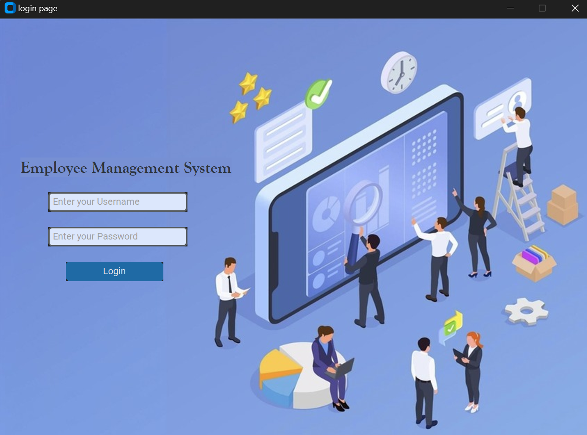
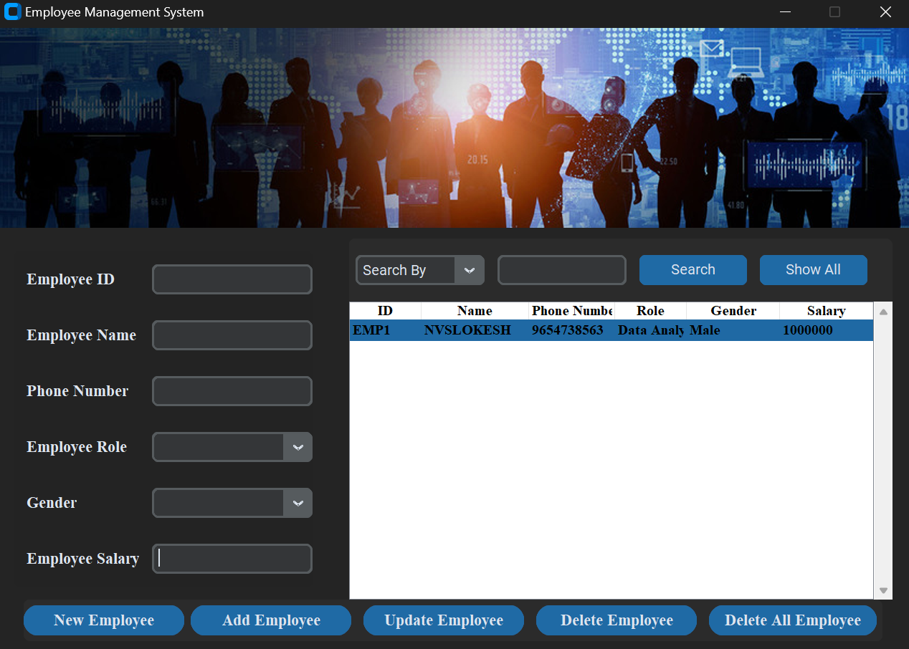

# Employee Management System

## Project Overview

The Employee Management System is a Python-based application that allows administrators to manage employee records efficiently. It features functionalities like adding new employees, updating details, deleting records, and searching for specific employees using MySQL as the database backend. This project is ideal for organizations looking for a simple yet powerful solution for managing employee data.

### Features
- Add new employee records.
- Update existing employee details.
- Delete employee records.
- Search and retrieve employee information.
- Tkinter-based GUI for intuitive interaction.
- User-friendly command-line interface.

## Technologies Used
- **Programming Language:** Python
- **Database:** MySQL
- **GUI Library:** Tkinter
- **IDE/Tools:** VsCode, MySQL Workbench

## Screenshots

### 1. Login Page


### 2. Employee Interface

## Installation and Setup

1. **Clone the repository:**
    ```bash
    git clone https://github.com/your-username/employee-management-system.git
    ```
2. **Navigate to the project directory:**
    ```bash
    cd employee-management-system
    ```
3. **Install required Python packages:**
    ```bash
    pip install mysql-connector-python
    ```
4. **Set up the MySQL database:**
    - Update the database connection details in `config.py`.

5. **Run the application:**
    ```bash
    python main.py
    ```
